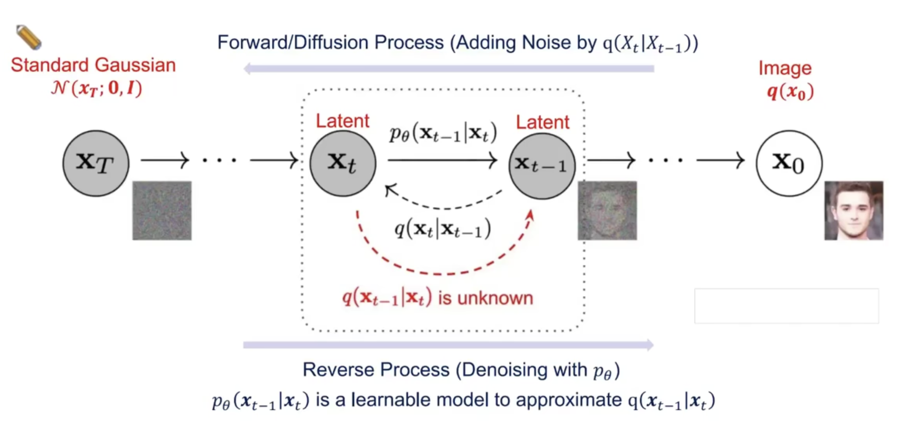

# DDPM论文笔记

## 概率论

### 1. 先验概率和后验概率

- 先验概率：根据以往经验和分析得到的概率，如全概率公式中的，它往往作为“由因求果”问题中的“因”出现，如 $q(x_{t}|x_{t-1})$
- 后验概率：指在得到“结果”的信息后重新修正的概率，是“指果求因”问题中的“因”，如 $p(x_{t-1}|x_{t})$

### 2. 条件概率的一般形式

$$
P(A,B,C) = P(C|B,A)P(B,A) = P(C|B,A)P(B|A)P(A)
\\
P(B,C|A) = P(B|A)P(C|A,B)
$$

### 3. **马尔可夫链条件概率形式(重要！)**

马尔可夫链指当前状态的概率只与上一时刻有关，例如满足马尔科夫关系 $A \to B \to C$ ，那么有：

$$
P(A,B,C) = P(C|B,A)P(B,A) = P(C|B)P(B|A)P(A)
\\
P(B,C|A) = P(B|A)P(C|B)
$$

### 4. 高斯分布的KL散度公式

KL散度衡量的是两个概率分布之间的“距离”，可以类比为两个向量之间的距离，但实际公式要复杂一些

对于两个单一变量的高斯分步 $p\sim\mathcal{N}(\mu_{1},\sigma_{1}^{2})$ 和 $q\sim\mathcal{N}(\mu_{2},\sigma_{2}^{2})$ 而言，他们的KL散度为：

$$
D_{KL}(p||q) = \log(\frac{\sigma_{2}}{\sigma_{1}})\,+\,\frac{\sigma_{1}^{2}+(\mu_{1}-\mu_{2})^{2}}{2\sigma_{2}^{2}}\,-\,\frac{1}{2}
$$

KL散度衡量的是用一个分布 $q$ 近似真实分布 $p$ 时的信息损失。它量化了这两个分布之间的差异，但具有非对称性，即

$$
D_{KL}(p||q)\, != \,D_{KL}(q||p)
$$

在模型优化中，KL散度常作为损失函数，引导模型 $q$ 逼近真实分布 $p$ 。例如，变分自编码器（VAE）中用它约束潜在变量的分布。

### 5. 参数重整化（重参数技巧）

若希望从高斯分布 $\mathcal{N}(\mu,\sigma^{2})$ 中采样，可以先从标准分布 $\mathcal{N}(0,1)$ 采样出 $z$ ，再得到 $\sigma\times z+\mu$ ，这就是我们想要采样的结果。这样做的好处是将最畸形转移到了 $z$ 这个常量上，而 $\sigma$ 和 $\mu$ 则当作仿射变换网络的一部分。

## 有向图中的DDPM

在Reverse Process中，贝叶斯法则失效了！我们无法直接用公式推导后验概率分布，因此我们要采用一个新的模型进行逼近。

所以实际上DDPM就是：

1. 先定义了一个加噪的先验概率分布，我们并不能从公式中推导其后验概率分布。
2. 然后通过神经网络去逼近这个理论上无法推导得到的概率分布。

## DDPM中的前向传播

- （定义）前向传播过程由马尔可夫链定义为：

$$
q(x_{1:T}|x_{0}) \,=\, \prod_{t=1}^{T}q(x_{t}|x_{t-1})
$$

- 这个马尔可夫链逐渐向原图像中添加高斯噪声：

$$
q(x_{t}|x_{t-1}) \,=\, \mathcal{N}(x_{t}|\sqrt{1-\beta_{t}}\,x_{t-1},\beta_{t}I)
$$

- 高斯分布的线性组合仍然是高斯分布：

$$
q(x_{t}|x_{0}) \,=\, \mathcal{N}(x_{t}|\sqrt{\overline\alpha_{t}}x_{t-1},(1-\overline\alpha_{t})I)
\\
其中 \overline\alpha_{t} \,=\, \prod_{s=1}^{t}(1-\beta_{s})
$$

- 适当选择 $\beta_{t}（0<\beta_{t}<1）$ 可以导致：

$$
\lim_{n \to \infty}\overline\alpha_{t} = 0
\\
\lim_{t \to \infty}q(x_{t}|x_{0}) \,=\, \mathcal{N}(0,1)
$$

## DDPM中的反向传播

### 1. 传播过程

- （目标）通过对标准高斯分布噪声 $x_{T}$ 去噪来生成图片：

$$
p_{\theta}(x_{0}) \,=\, \int p_{\theta}(x_{0:T})dx_{1:T}
$$

- （定义）反向过程就是由马尔可夫链定义的合分布 $p_{\theta}(x_{0:T})$ ：

$$
p_{\theta}(x_{0:T}) = p_{\theta}(x_{T})\,\prod_{t=1}^{T}p_{\theta}(x_{t-1}|x_{t})
$$

- 每个参数 $p_{\theta}(x_{t-1}|x_{t})$ 都通过下式来逐步逼近未知的 $q(x_{t-1}|x_{t})$ ：

$$
p_{\theta}(x_{t-1}|x_{t}) \,=\, \mathcal{N}(x_{t-1}|\mu_{\theta}(x_{t},t),\textstyle \sum_{\theta}(x_{t},t))
$$

- $\mu_{\theta}$ 是可学习参数
- $\textstyle \sum_{\theta}$ 可以是可学习的，但是我们简单地把它设为 $\sigma_{t}I$ 。

### 2. 损失函数

$$
D_{KL}\left(q\left(x_{0},x_{1},···,x_{T}\right)||p_{\theta}\left(x_{0},x_{1},···,x_{T}\right)\right)
\\
= -E_{q(x_{0},x_{1},···,x_{T})}\left[\log p_{\theta}\left(x_{0},x_{1},···,x_{T}\right)\right] + C
\\
= -E_{q\left(x_{0},x_{1},···,x_{T}\right)}\left[-\log p(x_{T})-\sum_{t=1}^{T}\log \frac{p_{\theta}(x_{t-1}|x_{t})}{q(x_{t}|x_{t-1})}\right] + C
\\
:=-L_{VLB}(x_{0}) + C
\\
\ge E\left [ -\log p_{\theta}(x_{0}) \right] + C (由琴生不等式)
$$

其中 $L_{VLB}(x_{0})$ 是 $x_{0}$ 的对数似然的变分下界(variational lower bound(VLB) of the log-likelihood of the data $x_{0}$)
