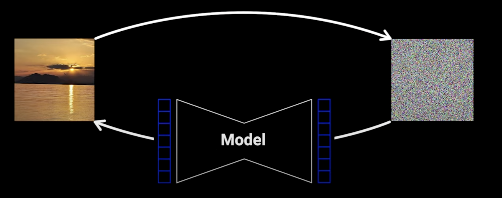

# 扩散模型的一般概念

## 1. 定义

2015年的论文将扩散模型描述如下：

- The essential idea is to systematically and slowly destroy structure in a data distribution through an iterative **forward diffusion process**. We then learn a **reverse diffusion process** that restores structure in data, yielding a highly flexible and tractable generative model of the data.
- 其关键理念在于通过一个迭代式的**正向扩散流程**，有系统且逐步地破坏数据分布中的结构。随后，我们学习一种**反向扩散流程**，用于恢复数据中的结构，由此生成一个高度灵活且易于处理的关于数据的生成模型。

## 2. 前向过程 (Foward Process)

我们从原始图像开始一步一步地向图像中添加越来越多的噪声，如果我们重复此操作足够多次，图像将变成纯噪声。2015年的论文中决定从正态分布中采样噪声，这一点在后续一直没有变化。

**注意：** 在前向过程中，我们不会在每一步都是用相同数量的噪声，而是由一个缩放均值和方差的调度器来调节的，这确保了**随着噪声的添加，方差不会爆炸。**

从一张图片变成纯噪声是相当简单的过程，但是学习相反的过程是极其困难的

## 3. 反向扩散过程 (Reverse Diffusion Process)

神经网络学习怎样逐步从图像中去除噪声，这样我们就可以给模型一个仅由从正态分布中采样得到的噪声图像，让模型逐渐去除噪声，直到我们得到一个清晰的图像。

## 4. 神经网络

2020年的DDPM论文指出神经网络可以预测的三个变量：

1. 每个时间步的噪声平均值。
2. 直接预测原始图像。(X)
3. 直接预测图像中的噪声，然后可以从噪声图像中减去噪声，得到噪声少一点的图像。

大部分人都选择了第三个，因为我们在训练过程中会计算不同（随机选择）时间步的损失函数，不同任务目标计算得到的结果会根据损失值向不同的“隐含权重”收敛，而“预测噪声”这个目标会使权重更倾向于预测得到更低的噪声量，也就是最典型的 $Minimize$ 任务。你可以通过选择更复杂的目标来改变这种“隐形损失权重”，这样你所选择的噪声调度器就能够直接在高噪声量情况下产生更多样本。

# 背后的数学

## 符号统一

- $x_{t}$ 表示在时间步 $t$ 时的图像，其中 $x_{0}$ 表示原始图像，而最终遵循各向同性高斯分布的最终图像被称为 $x_{T}$
- $q(x_{t}|x_{t-1})$ 对应于前向过程，其输出图像是在输入图像的基础上叠加了一些小噪声。
- $p(x_{t-1}|x_{t})$ 对应于反向扩散过程，它以 $x_{t}$ 为输入，并使用神经网络生成样本 $x_{t-1}$

## 前向过程

$$
q(x_{t}|x_{t-1}) = \mathcal{N}(x_{t},\sqrt{1-\beta_{t}}\,x_{t-1},\beta_{t}I)
$$

其中：

- $\mathcal{N}$ 是正态分布
- $x_{t}$ 是输出
- $\sqrt{1-\beta_{t}}x_{t-1}$ 是平均值，也可以记为 $\mu_{t}$
- $\beta_{t}I$ 是方差，也可以记为 $\sigma_{t}^{2}$
- $\beta$ 是调度器，$\forall \beta \,,\, \beta \in (0,1) $

现在我们已经知道了前向过程中一步的公式，理论上只要将这个步骤重复1000次就可以得到结果，但是有一种更简单的方法，只用了一步就解决了。

首先我们新定义两个新变量

$$
\alpha_{t} = 1-\beta_{t}
\\
\overline\alpha_{t} = \prod_{s=1}^{t}\alpha_{s}
$$

然后我们可以利用重参数化技巧，也就是 $\mathcal{N}(\mu,\sigma^{2}) = \mu + \sigma\cdot\epsilon$ 来重写 $q(x_{t}|x_{t-1})$，其中 $\epsilon \sim \mathcal{N}(0,1)$

$$
q(x_{t}|x_{t-1}) = \mathcal{N}(x_{t},\sqrt{1-\beta_{t}}\,x_{t-1},\beta_{t}I)
\\
= \sqrt{1-\beta_{t}}\,x_{t-1}\,+\,\sqrt{\beta_{t}}\,\epsilon
\\
= \sqrt{\alpha_{t}}x_{t-1} \,+\, \sqrt{1-\alpha_{t}}\,\epsilon
$$

再将 $q(x_{t-1}|x_{t-2})$ 以类似的形式写出来，在上式中将 $x_{t-1}$ 替换为 $x_{t-2}$ 的表达式，可得：

$$
q(x_{t}|x_{t-1}) = \sqrt{\alpha_{t}}x_{t-1} \,+\, \sqrt{1-\alpha_{t}}\,\epsilon
\\
= \sqrt{\alpha_{t}\alpha_{t-1}}x_{t-2} \,+\, \sqrt{1-\alpha_{t}\alpha_{t-1}}\,\epsilon
\\
= \sqrt{\alpha_{t}\alpha_{t-1}\alpha_{t-2}}x_{t-3} \,+\, \sqrt{1-\alpha_{t}\alpha_{t-1}\alpha_{t-2}}\,\epsilon
\\
···
$$

如此反复迭代，最终可以得到 $x_{t}$ 和 $x_{0}$ 之间的关系：

$$
q(x_{t}|x_{0}) = \sqrt{\overline\alpha_{t}}x_{0} \,+\, \sqrt{1-\overline\alpha_{t}}\,\epsilon
\\
\sim \mathcal{N}(x_{t},\sqrt{\overline\alpha_{t}}x_{0},(1-\overline\alpha_{t})I)
$$

## 反向扩散过程

$$
p(x_{t-1}|x_{t}) = \mathcal{N}(x_{t-1},\mu_{\theta}(x_{t},t),\Sigma_{\theta}(x_{t},t))
$$

其中：

- $\mathcal{N}$ 是正态分布
- $x_{t-1}$ 是输出
- $\Sigma_{\theta}$ 是网络本应该学习的方差参数，但是此处我们将其设定为一个固定的值，因而不对其进行学习
- $\mu_{\theta}$ 是网络需要学习的均值参数

## 损失函数

理论上的损失函数应该是一个负对数似然函数

$$
-\log{p_{\theta}(x_{0})}
$$

但是 $x_{0}$ 的概率很难计算，因为它取决于 $x_{0}$ 之前所有的时间步的输入，即 $x_{1:T}$

因此我们决定计算该函数的变分下界，即

$$
-\log{p_{\theta}(x_{0})} \le -\log{p_{\theta}(x_{0})} \,+\, D_{KL}(q(x_{1:T}|x_{0})||p_{\theta}(x_{1:T}|x_{0}))
$$

KL散度是衡量两个分布相似程度的指标，并且始终为非负数。

对于两个单一变量的高斯分步 $p\sim\mathcal{N}(\mu_{1},\sigma_{1}^{2})$ 和 $q\sim\mathcal{N}(\mu_{2},\sigma_{2}^{2})$ 而言，他们的KL散度为：

$$
D_{KL}(p||q) = \log(\frac{\sigma_{2}}{\sigma_{1}})\,+\,\frac{\sigma_{1}^{2}+(\mu_{1}-\mu_{2})^{2}}{2\sigma_{2}^{2}}\,-\,\frac{1}{2}
$$

在模型优化中，KL散度常作为损失函数，引导模型 $q$ 逼近真实分布 $p$ 。例如，变分自编码器（VAE）中用它约束潜在变量的分布。

下面开始推导为什么加上KL散度之后能够使得计算更加方便

- 我们可以将KL散度公式变为以下形式：

$$
D_{KL}(q(x_{1:T}|x_{0})||p_{\theta}(x_{1:T}|x_{0})) = \log\left( \frac{q(x_{1:T}|x_{0})}{p_{\theta}(x_{1:T}|x_{0})} \right)
$$

- 对数中的分母可以利用贝叶斯公式变为以下形式：

$$
p_{\theta}(x_{1:T}|x_{0}) = \frac{p_{\theta}(x_{0}|x_{1:T})p_{\theta}(x_{1:T})}{p_{\theta}(x_{0})}
$$

- 而这个贝叶斯公式中的分子又可以由全概率公式合并为：

$$
p_{\theta}(x_{0}|x_{1:T})p_{\theta}(x_{1:T}) = p_{\theta}(x_{0},x_{1:T}) = p_{\theta}(x_{0:T})
$$

- 所以原来的对数形式就可以写成：

$$
\log\left( \frac{q(x_{1:T}|x_{0})}{p_{\theta}(x_{1:T}|x_{0})} \right) = \log\left( \frac{q(x_{1:T}|x_{0})}{\frac{p_{\theta}(x_{0:T})}{p_{\theta}(x_{0})}} \right) = \log\left( \frac{q(x_{1:T}|x_{0})}{p_{\theta}(x_{0:T})} \right) + \log\left( p_{\theta}(x_{0}) \right)
$$

- 因此它和原本的 $-\log\left( p_{\theta}(x_{0}) \right)$相互抵消，最终损失函数变为

$$
\log\left( \frac{q(x_{1:T}|x_{0})}{p_{\theta}(x_{0:T})} \right)
$$

还没有结束！这个函数实际上看着还是十分复杂，我们对它进行进一步处理：

- 我们对对数中的分子分母都根据其定义进行展开，可以得到：

$$
\log\left( \frac{q(x_{1:T}|x_{0})}{p_{\theta}(x_{0:T})} \right) 
= \log\left( \frac{\textstyle \prod_{t=1}^{T}q(x_{t}|x_{t-1})}{p(x_{T})\textstyle \prod_{t=1}^{T}p_{\theta}(x_{t-1}|x_{t})} \right)
= \log\left( \frac{\textstyle \prod_{t=1}^{T}q(x_{t}|x_{t-1})}{\textstyle \prod_{t=1}^{T}p_{\theta}(x_{t-1}|x_{t})} \right)-\log \left( p(x_{T}) \right)
$$

- 利用对数性质，将 $\prod$ 移到对数外变成 $\sum$

$$
原式 = \sum_{t=1}^{T}\log \left( \frac{q(x_{t}|x_{t-1})}{p_{\theta}(x_{t-1}|x_{t})} \right) - \log \left( p(x_{T}) \right) 
= \sum_{t=2}^{T}\log \left( \frac{q(x_{t}|x_{t-1})}{p_{\theta}(x_{t-1}|x_{t})} \right)+ \log\left( \frac{q(x_{1}|x_{0})}{p_{\theta}(x_{0}|x_{1})} \right) - \log \left( p(x_{T}) \right)
$$

- 利用贝叶斯公式，将 $\sum$ 中所有的分母都该写成如下形式：

$$
q(x_{t}|x_{t-1}) = \frac{q(x_{t-1}|x_{t})q(x_{t})}{q(x_{t-1})} = \frac{q(x_{t-1}|x_{t},x_{0})q(x_{t}|x_{0})}{q(x_{t-1}|x_{0})}
$$

- 那么再代回原式后得到：

$$
原式 = \sum_{t=2}^{T}\log \left( \frac{q(x_{t-1}|x_{t},x_{0})q(x_{t}|x_{0})}{p_{\theta}(x_{t-1}|x_{t})q(x_{t-1}|x_{0})} \right)+ \log\left( \frac{q(x_{1}|x_{0})}{p_{\theta}(x_{0}|x_{1})} \right) - \log \left( p(x_{T}) \right)
$$

- 我们将 $\sum$ 中的log函数拆开得到

$$
原式 = \sum_{t=2}^{T}\log \left( \frac{q(x_{t-1}|x_{t},x_{0})}{p_{\theta}(x_{t-1}|x_{t})} \right) + \sum_{t=2}^{T}\log \left( \frac{q(x_{t}|x_{0})}{q(x_{t-1}|x_{0})} \right) + \log\left( \frac{q(x_{1}|x_{0})}{p_{\theta}(x_{0}|x_{1})} \right) - \log \left( p(x_{T}) \right)
$$

- 第二个 $\sum$ 中的式子展开后，中间项会全部抵消，最后留下：

$$
原式 = \sum_{t=2}^{T}\log \left( \frac{q(x_{t-1}|x_{t},x_{0})}{p_{\theta}(x_{t-1}|x_{t})} \right) + \log\left( \frac{q(x_{T}|x_{0})}{q(x_{1}|x_{0})} \right) + \log\left( \frac{q(x_{1}|x_{0})}{p_{\theta}(x_{0}|x_{1})} \right) - \log \left( p(x_{T}) \right)
$$

- 二、三两项消去后可得到

$$
原式 = \sum_{t=2}^{T}\log \left( \frac{q(x_{t-1}|x_{t},x_{0})}{p_{\theta}(x_{t-1}|x_{t})} \right) + \log\left( \frac{q(x_{T}|x_{0})}{p(x_{T })} \right) - \log(p_{\theta}(x_{0}|x_{1})) 
$$

- 我们能够将第二项看作一个KL散度，也就是 $D_{KL}(q(x_{T}|x_{0})||p(x_{T}))$ ，而由于q只是一个前向传播过程且 $p(x_{T})$ 只是一个服从高斯正太分布的随机分布，没有任何可以学习的参数，所以它是一个定量，完全可以被忽略。

# 四篇论文的不同改进之处

# 总结
